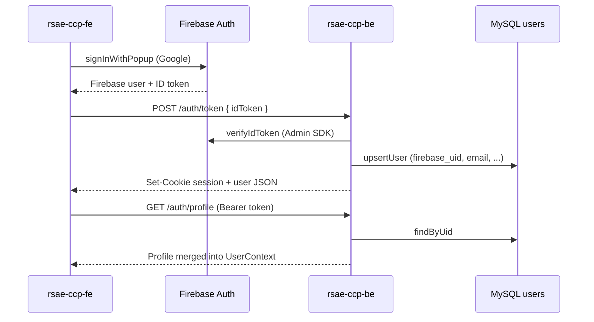

# Authentication

The **RSAE Community Crowdsourcing Platform (CCP)** spans two repositories that work together:

| Repository | Role |
|------------|------|
| [`rsae-ccp-fe`](https://github.com/devlai23/rsae-ccp-fe) | React + Vite SPA: login UI, route guards, Firebase client SDK |
| [`rsae-ccp-be`](https://github.com/devlai23/rsae-ccp-be) | Express API: verifies Firebase tokens, syncs users to MySQL, protects admin endpoints |

Authentication is built on **Firebase Authentication** for identity (who is signed in) and **Firebase custom claims** for authorization (whether someone is an admin). Application profile data (username, email, name) lives in a **`users`** table in **AWS RDS / MySQL**. The backend never stores passwords; Firebase handles credentials.

This page describes how those pieces connect across the full project. For environment setup, see [Getting Started](../getting-started).

---

## Roles

There are effectively two kinds of users on the platform:

| Role | How it is assigned | What they can do |
|------|-------------------|------------------|
| **Public visitor** | No login required | Browse approved proposals, submit ideas, comment, support (vote on) proposals |
| **Admin** | Firebase custom claim `role: "admin"` on their account | Access `/dashboard` and `/audit-log`, approve/reject proposals, delete comments, see internal submitter info |

There is no separate “resident account” role in the database today. Community members interact with the site **without signing in**. The login flow is aimed at **staff/admin** access to the dashboard.

Admin checks in the frontend look like:

```js
const isAdmin = user?.role === 'admin';
```

On the backend, `requireAdmin` middleware reads the same claim from the decoded Firebase ID token:

```js
const role = req.user?.role;
const isAdmin =
  role === 'admin' ||
  req.user?.admin === true ||
  req.user?.isAdmin === true ||
  req.user?.claims?.admin === true;
```

:::tip Assigning admin access
Admin role is **not** stored in the MySQL `users` table. Set it in Firebase (custom claims) for the user’s `firebase_uid`. After changing claims, the user must **sign out and sign in again** so the client receives a fresh ID token.
:::

---

## Architecture overview

At a high level, sign-in follows this path:



**Two stores of user-related data:**

1. **Firebase `auth/users`** (managed by Firebase)  
   - Email, UID, OAuth provider, password hashes (if email/password were enabled).  
   - **Custom claims** (e.g. `{ "role": "admin" }`) ride on the ID token.  
   - You cannot add arbitrary columns; use claims or your own DB for app-specific fields.

2. **MySQL `users` table** (managed by `rsae-ccp-be`)  
   - `firebase_uid`, `username`, `email`, `firstname`, `lastname`.  
   - Created on signup or first Google sign-in via `userRepository.upsertUser`.  
   - Used for display and listing users; **not** for password verification.

Anyone who can use the site as an authenticated admin exists in **both** places after first login.

---

## Signing in

### Admin login (current production path)

1. User opens **`/login`** (Admin Portal Login).
2. Clicks **Sign in with Google** → `UserContext.googleAuth()` runs `signInWithPopup` against Firebase.
3. Frontend sends the Firebase **ID token** to `POST /auth/token` with `credentials: 'include'`.
4. Backend verifies the token, upserts the row in `users`, sets an **httpOnly `session` cookie** (1 hour), and writes an audit log entry (`auth.login`, provider `google`).
5. `onAuthStateChanged` fires; `UserContext` calls `GET /auth/profile` with `Authorization: Bearer <idToken>` and merges the JSON into React state.
6. Login page navigates to **`/dashboard`**.

`/signup` redirects to `/login`. Email/password signup exists on the API (`POST /auth/signup`) but the UI no longer exposes a public registration form—admin access is **Google-only** in the frontend.

### Email and password (API support, limited UI)

The backend still supports:

- `POST /auth/signup` — creates Firebase user + MySQL row  
- `POST /auth/login` — verifies ID token, sets `session` cookie  

Firebase email/password must be enabled in the Firebase console. The frontend `UserContext.login()` uses `signInWithEmailAndPassword`, but the main login page does not surface email fields today.

### Password reset

- **Request reset:** `UserContext.requestPasswordReset()` → Firebase `sendPasswordResetEmail`.  
- **Complete reset:** Firebase email link → `/auth/reset-password` page.

### OAuth redirect callback

For flows that use `signInWithRedirect` (e.g. some mobile browsers), **`/auth/callback`** runs `getRedirectResult`, posts the token to `/auth/token`, then redirects home or back to `/login` on error.

---

## Sessions and tokens

The app uses **two complementary mechanisms**:

| Mechanism | Where | Purpose |
|-----------|--------|---------|
| **Firebase ID token** | `Authorization: Bearer …` header from the client | Primary credential for `authMiddleware` on protected API routes; short-lived, refreshed by the Firebase SDK |
| **`session` httpOnly cookie** | Set by `POST /auth/login` and `POST /auth/token` | Used by `GET /auth/me` and `POST /auth/logout`; not sent automatically on all frontend `fetch` calls—most API calls use the Bearer header instead |

Cookie flags:

- `httpOnly: true`  
- `secure: true` in production  
- `sameSite: 'strict'`  
- `maxAge`: 1 hour  

Protected backend routes expect the **Bearer token**, not the cookie. The cookie is mainly for server-side session-style endpoints and logout cleanup.

---

## Frontend (`rsae-ccp-fe`)

### Configuration

[`src/firebase-config.js`](https://github.com/devlai23/rsae-ccp-fe/blob/main/src/firebase-config.js) initializes Firebase only when all required `VITE_FIREBASE_*` variables are set. If config is missing, auth is disabled and a console warning is shown.

Required variables (see `.env.example`):

- `VITE_FIREBASE_API_KEY`
- `VITE_FIREBASE_AUTH_DOMAIN`
- `VITE_FIREBASE_PROJECT_ID`
- `VITE_FIREBASE_APP_ID`
- (optional) storage, messaging, measurement IDs  
- `VITE_BACKEND_URL` — base URL for API calls (e.g. `http://localhost:5050`)

### `UserContext`

[`src/common/contexts/UserContext.jsx`](https://github.com/devlai23/rsae-ccp-fe/blob/main/src/common/contexts/UserContext.jsx) wraps the app in `App.jsx` and provides:

| Export | Behavior |
|--------|----------|
| `user` | Firebase user fields merged with `/auth/profile` response |
| `isLoading` | `true` until first `onAuthStateChanged` completes |
| `login(email, password)` | Firebase email/password sign-in |
| `logout()` | Firebase `signOut` |
| `googleAuth()` | Google popup + `POST /auth/token` |
| `requestPasswordReset(email)` | Firebase reset email |

On every auth state change, if a Firebase user exists, the context loads backend profile data:

```js
const idToken = await firebaseUser.getIdToken();
const response = await fetch(`${VITE_BACKEND_URL}/auth/profile`, {
  headers: { Authorization: `Bearer ${idToken}` },
});
```

If the profile request fails, the context falls back to the Firebase user object only (admin UI may not work until profile/claims load correctly).

### Route protection

[`src/common/components/routes/ProtectedRoutes.jsx`](https://github.com/devlai23/rsae-ccp-fe/blob/main/src/common/components/routes/ProtectedRoutes.jsx):

| Component | Rule |
|-----------|------|
| `PrivateRoute` | Requires `user` → else redirect to `/login` |
| `PublicOnlyRoute` | Requires no `user` → else redirect to `/` |

**Protected routes** (must be logged in):

- `/dashboard` — proposal review metrics and status updates  
- `/audit-log` — admin action history  

**Public routes** (no login):

- `/`, `/browse`, `/submit`, proposal details modal, comments, support/vote  

**Layout:** [`NavLayout`](https://github.com/devlai23/rsae-ccp-fe/blob/main/src/common/layouts/NavLayout.jsx) shows `AdminHeader` when `user` is set, otherwise `UserHeader` (marketing nav with Login / Sign Up).

### Admin-only UI (client-side)

Even on public routes, components check `user?.role === 'admin'` to show extra UI:

- All proposal statuses on Browse (not only `approved`)  
- Approve/reject controls  
- Submitter email on proposal modal  
- Delete comment button  

Client checks are **not security**; the backend enforces admin on mutating endpoints.

### Calling the API with auth

Most authenticated requests attach the Firebase token manually, for example in Browse Ideas and the proposal modal:

```js
const token = await auth.currentUser?.getIdToken?.();
const headers = { Authorization: `Bearer ${token}` };
```

Vote requests also use `credentials: 'include'` for the anonymous voter cookie (see below).

---

## Backend (`rsae-ccp-be`)

### Firebase Admin SDK

[`src/config/firebase.js`](https://github.com/devlai23/rsae-ccp-be/blob/main/src/config/firebase.js) loads the service account from `FIREBASE_SERVICE_ACCOUNT_KEY` (JSON string in `.env`) and initializes `firebase-admin`. All token verification goes through `admin.auth().verifyIdToken()`.

:::danger Never commit service account JSON
Add `*-firebase-adminsdk-*.json` to `.gitignore`. Paste the JSON into the environment variable only.
:::

### Auth routes

Mounted at **`/auth`** ([`src/routes/authRoutes.js`](https://github.com/devlai23/rsae-ccp-be/blob/main/src/routes/authRoutes.js)):

| Method | Path | Auth | Description |
|--------|------|------|-------------|
| `POST` | `/auth/signup` | None | Create Firebase user + MySQL row |
| `POST` | `/auth/login` | None | Verify `idToken`, set `session` cookie |
| `POST` | `/auth/token` | None | Google/OAuth sync: upsert user, set cookie |
| `POST` | `/auth/logout` | Optional cookie/token | Clear cookie, audit log |
| `GET` | `/auth/me` | Cookie or Bearer | Current user profile |
| `GET` | `/auth/profile` | Cookie or Bearer | Alias of `/me` (used by frontend) |
| `GET` | `/auth/users` | Bearer + `authMiddleware` | List users (admin tooling) |

Controller logic lives in [`src/controllers/authController.js`](https://github.com/devlai23/rsae-ccp-be/blob/main/src/controllers/authController.js).

### Middleware

| Middleware | File | Behavior |
|------------|------|----------|
| `authMiddleware` | [`authMiddleware.js`](https://github.com/devlai23/rsae-ccp-be/blob/main/src/middleware/authMiddleware.js) | Requires `Authorization: Bearer <Firebase ID token>`, sets `req.user` to decoded token |
| `requireAdmin` | [`requireAdmin.js`](https://github.com/devlai23/rsae-ccp-be/blob/main/src/middleware/requireAdmin.js) | Runs after `authMiddleware`; requires admin claim |

### Routes that require authentication

| Prefix | Middleware | Examples |
|--------|------------|----------|
| `/dashboard/*` | `authMiddleware` on router | Metrics, categories |
| `/audit-logs` | `authMiddleware` | List audit events |
| `PUT /proposals/:id/status` | `authMiddleware` | Approve / reject |
| `DELETE /comments/:id` | `authMiddleware` + `requireAdmin` | Soft-delete comment |
| `GET /auth/users` | `authMiddleware` | User list |

### Public routes (no user login)

| Prefix | Notes |
|--------|--------|
| `GET/POST /proposals` | List, create, detail, tags |
| `POST /proposals/:id/vote` | Support toggle (see anonymous voter id) |
| `GET/POST /proposals/:id/comments` | Read/create comments |
| `GET /health` | Health check |

CORS ([`src/server.js`](https://github.com/devlai23/rsae-ccp-be/blob/main/src/server.js)) allows `FRONTEND_URL` and `FRONTEND_URL_DEV` with `credentials: true` so cookies and cross-origin requests work in development.

### Database: `users` table

Defined in [`sql/create_tables_mysql.sql`](https://github.com/devlai23/rsae-ccp-be/blob/main/sql/create_tables_mysql.sql):

```sql
CREATE TABLE IF NOT EXISTS users (
  id            INT AUTO_INCREMENT PRIMARY KEY,
  firebase_uid  VARCHAR(128) NOT NULL,
  username      VARCHAR(50)  NOT NULL,
  email         VARCHAR(255) NOT NULL,
  firstname     VARCHAR(100) DEFAULT NULL,
  lastname      VARCHAR(100) DEFAULT NULL,
  ...
  UNIQUE KEY idx_firebase_uid (firebase_uid),
  UNIQUE KEY idx_username     (username),
  UNIQUE KEY idx_email        (email)
);
```

[`userRepository`](https://github.com/devlai23/rsae-ccp-be/blob/main/src/repositories/userRepository.js) delegates to [`mysqlProvider`](https://github.com/devlai23/rsae-ccp-be/blob/main/src/providers/mysqlProvider.js) for `createUser`, `findByUid`, `upsertUser`, and `getAll`.

### Audit logging

Login, logout, and Google token sync write to **`audit_logs`** via [`auditLogService`](https://github.com/devlai23/rsae-ccp-be/blob/main/src/services/auditLogService.js) with action types `auth.login` and `auth.logout`, capturing actor UID, email, and role from the decoded token when available.

---

## Anonymous support (voting) — not user authentication

Supporting a proposal does **not** use Firebase login. It uses a separate **anonymous voter id**:

| Piece | Detail |
|-------|--------|
| Cookie name | `ccp_vid` (httpOnly UUID, 1 year) |
| Module | [`src/lib/voterCookie.js`](https://github.com/devlai23/rsae-ccp-be/blob/main/src/lib/voterCookie.js) |
| Endpoint | `POST /proposals/:id/vote` |
| Rate limit | [`voteRateLimit` middleware](https://github.com/devlai23/rsae-ccp-be/blob/main/src/middleware/voteRateLimit.js) |
| Storage | `proposal_votes` table + `proposals.votes` counter |

List/detail responses include `hasVoted` by comparing the voter cookie to `proposal_votes`. This is independent of admin authentication.

---

## Environment variables (auth-related)

### Frontend (`rsae-ccp-fe/.env`)

```bash
VITE_BACKEND_URL=http://localhost:5050
VITE_FIREBASE_API_KEY=...
VITE_FIREBASE_AUTH_DOMAIN=...
VITE_FIREBASE_PROJECT_ID=...
VITE_FIREBASE_STORAGE_BUCKET=...
VITE_FIREBASE_MESSAGING_SENDER_ID=...
VITE_FIREBASE_APP_ID=...
VITE_FIREBASE_MEASUREMENT_ID=...   # optional
```

### Backend (`rsae-ccp-be/.env`)

```bash
PORT=5050
NODE_ENV=development
FRONTEND_URL=https://your-production-frontend.example
FRONTEND_URL_DEV=http://localhost:5173
DATABASE_URL=mysql://...
FIREBASE_SERVICE_ACCOUNT_KEY='{"type":"service_account",...}'
```

---

## Granting admin access (Firebase custom claims)

Because `role` is not in MySQL, promote a user in Firebase:

1. Open [Firebase Console](https://console.firebase.google.com/) → your project → **Authentication** → select the user.  
2. Note their **User UID** (`firebase_uid` in MySQL).  
3. Use the Firebase Admin SDK or CLI to set custom claims, for example:

```js
await admin.auth().setCustomUserClaims(uid, { role: 'admin' });
```

4. User signs out and signs in again.  
5. Confirm `user.role === 'admin'` in the app and that dashboard/audit routes load.

Until this claim is set, authenticated Google users are regular signed-in users without admin API access (`403` on protected admin operations).

---

## Security summary

| Concern | Approach |
|---------|----------|
| Password storage | Delegated to Firebase |
| API authorization | Verify Firebase ID token on each protected request |
| Admin operations | `requireAdmin` + Firebase `role` claim |
| XSS stealing session | `session` cookie is httpOnly |
| CSRF on cookie endpoints | SameSite strict; most writes use Bearer header |
| Public spam on votes | IP rate limit + per-voter cookie + DB uniqueness |
| Secrets in git | Service account JSON only in env; gitignore pattern for key files |

---

## Troubleshooting

| Symptom | Likely cause |
|---------|----------------|
| Auth flows disabled / warning in console | Missing `VITE_FIREBASE_*` in frontend `.env` |
| `401` on dashboard API | No Bearer token, expired token, or wrong backend URL |
| Logged in but no admin UI | Missing `role: 'admin'` custom claim or stale token |
| Google login works but no MySQL row | `/auth/token` failed; check backend logs and `DATABASE_URL` |
| CORS errors | `FRONTEND_URL_DEV` must match Vite origin (e.g. `http://localhost:5173`) |
| Push rejected for secrets | Never commit `*-firebase-adminsdk-*.json`; rotate key if leaked |

---

## Related documentation

- [Getting Started](../getting-started) — clone, env, Firebase console setup  
- [Frontend project structure](../frontend/project-structure)  
- [Backend project structure](./project-structure)  
- [Backend development](./development)

For a similar narrative structure (roles, sign-up policy, dual user stores), see the [Sokana CRM Authentication](https://documentation-theta-blush.vercel.app/authentication) documentation.
